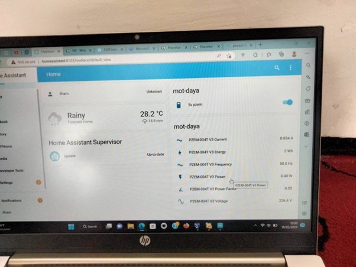
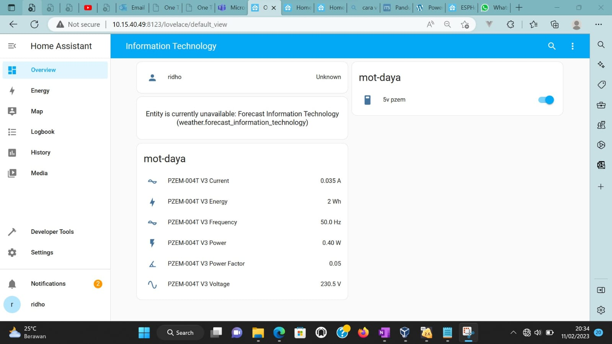

# Project Name
Power Monitor

# Objective
- Membuat alat yang dapat memonitor daya penggunaan listrik suatu ruangan.
- Data ditampilkan ke dashboard suatu web.
- Tampilkan menggunakan ESPHome.
- Integrasikan dengan semua alat.

# Stakeholders
### Penanggung Jawab: 
Dr.tech.Ir. Raden Venantius Hari Ginardi, M.Sc - Kadep
Ridho Rahman Hariadi, S.Kom., M.Sc.
Irzal Ahmad Sabilla, S. Kom.,M.Kom
Ketua: Naufal Ulhaq
Anggota:
Ilham Muhammad Sakti
Rafif Naufaldi Wibowo
Albert Agung Andika
Wirid

# Project Schedule
Januari 2023 - Maret 2023

# Documentation
## Components
- ESP32
- Sensor PZEM-004T
- Sensor Arus

## Code
### ESP32
```YAML
esphome:
 name: mot-daya

esp8266:
 board: nodemcuv2

# Enable logging
logger:

# Enable Home Assistant API
api:
 encryption:
   key: "+m4nJeaWt1xUvm4xlEN4OPfWqJgu6QzXSAPV3o4eswk="

ota:
 password: "374a13f6d51b6a4ef354c7aa92deec5e"

wifi:
 ssid: 'IT-SOLID-NO-CIRCLE'
 password: 'majuteru5'

 # Enable fallback hotspot (captive portal) in case wifi connection fails
 ap:
   ssid: "Mot-Daya Fallback Hotspot"
   password: "t2Z2QsXIgH4i"

captive_portal:

# switch pzem 004T
switch:
 - platform: gpio
   name: '5v pzem'
   pin: 14

# Example configuration entry
uart:
 rx_pin: D1
 tx_pin: D2
 baud_rate: 9600

modbus:

sensor:
 - platform: pzemac
   current:
     name: "PZEM-004T V3 Current"
   voltage:
     name: "PZEM-004T V3 Voltage"
   energy:
     name: "PZEM-004T V3 Energy"
   power:
     name: "PZEM-004T V3 Power"
   frequency:
     name: "PZEM-004T V3 Frequency"
   power_factor:
     name: "PZEM-004T V3 Power Factor"
   update_interval: 60s
```
## Dashboard




## Link Yt 
https://www.youtube.com/watch?v=7smPYnFAhEk 


